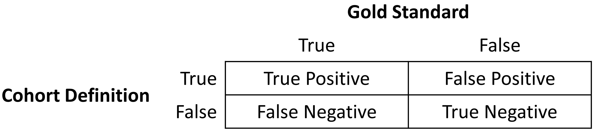
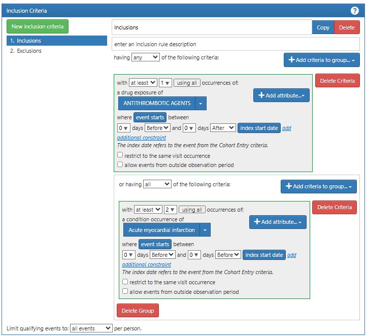
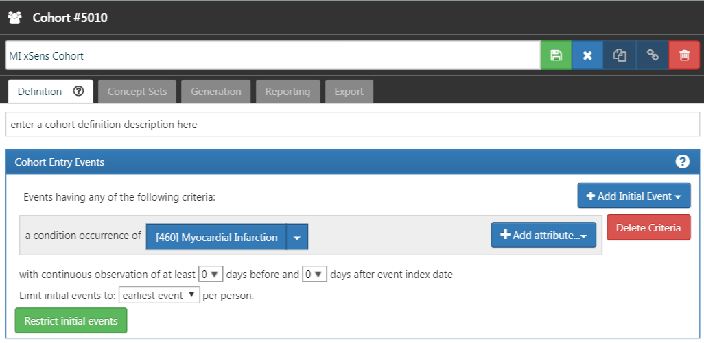

# Clinical Validity {#sec-quality-clinical}

**Chapter Leads**: Joel Swerdel

::: {.callout-note}
This is page is currently a stub.
The chapter is being written in the OHDSI Teams directory.
When the draft is complete,
it will be converted to markdown and moved to this file.

Author Resources (requires an OHDSI Teams account):

* [Chapter Directory](https://ohdsiorg.sharepoint.com/sites/Workgroup-EducationWorkingGroup/Shared%20Documents/Forms/AllItems.aspx?id=%2Fsites%2FWorkgroup%2DEducationWorkingGroup%2FShared%20Documents%2FSection%20IV%20%2D%20Quality%2FChapter%2017%20%2D%20Cohort%20Validity&viewid=05fec2cc%2Dec8a%2D4d04%2Db565%2Dcf1289b96f67)
* [Book Layout](https://ohdsiorg.sharepoint.com/:x:/r/sites/Workgroup-EducationWorkingGroup/_layouts/15/Doc2.aspx?action=edit&sourcedoc=%7B1fa31e39-1c5f-4918-b878-609ebd9810b3%7D&wdOrigin=TEAMS-WEB.teamsSdk_ns.rwc&wdExp=TEAMS-TREATMENT&wdhostclicktime=1748104477731&web=1)
* [Education Working Group SharePoint Drive](https://ohdsiorg.sharepoint.com/sites/Workgroup-EducationWorkingGroup/Shared%20Documents/Forms/AllItems.aspx?viewid=05fec2cc%2Dec8a%2D4d04%2Db565%2Dcf1289b96f67)

Public Resources:

* [Book of OHDSI, Edition 1](https://ohdsi.github.io/TheBookOfOhdsi/)
* [Source Code](https://github.com/OHDSI/TheBookOfOhdsi) for Book of OHDSI, Edition 1
* [OHDSI Home Page](https://ohdsi.org/)
:::

> The likelihood of transforming matter into energy is something akin
> to shooting birds in the dark in a country where there are only a few birds.
> *Einstein, 1935*

The vision of OHDSI is "A world in which observational research produces a comprehensive understanding of health and disease."
Retrospective designs provide a vehicle for research using existing data
but can be riddled with threats to various aspects of validity as discussed in Chapter14.
It is not easy to isolate clinical validity from quality of data and statistical methodology,
but here we will focus on three aspects in terms of clinical validity:
Characteristics of health care databases, Cohort validation, and Generalizability of the evidence.
Let's go back to the example of population-level estimation (Chapter 12).
We tried to answer the question "Do ACE inhibitors cause angioedema compared to thiazide or thiazide-like diuretics?"
In that example, we demonstrated that ACE inhibitors caused more
angioedema than thiazide or thiazide-like diuretics.
This chapter is dedicated to answer the question:
"To what extent does the analysis conducted match the clinical intention?"

## Characteristics of Health Care Databases

It is possible that what we found is the relationship between **prescription** of ACE inhibitor and angioedema
rather than the relationship between **use** of ACE inhibitor and angioedema.
We've already discussed data quality in the previous chapter (15).
The quality of the converted database into the Common Data Model (CDM) cannot exceed the original database.
Here we are addressing the characteristics of most healthcare utilization databases.
Many databases used in OHDSI originated from administrative claims or electronic health records (EHR).
Claims and EHR have different data capture processes, neither of which has research as a primary intention.
Data elements from claims records are captured for the purpose of reimbursement,
financial transactions between clinicians and payers whereby services provided
to patients by providers are sufficiently justified to enable agreement on payments by the responsible parties.
Data elements in EHR records are captured to support clinical care and administrative operations,
and they commonly only reflect the information that providers within a given health system feel
are necessary to document the current service and provide necessary context for anticipated
follow-up care within their health system.
They may not represent a patient's complete medical history and may not integrate data from across health systems.

To generate reliable evidence from observational data, it is useful for a researcher to understand the journey that the data undergoes from the moment that a patient seeks care through the moment that the data reflecting that care are used in an analysis.
As an example, "drug exposure" can be inferred from various sources of observational data,
including prescriptions written by clinicians, pharmacy dispensing records, hospital procedural administrations, or patient self-reported medication history.
The source of data can impact our level of confidence in the inference we draw about which patients did or did not use the drug, as well as when and for how long.
The data capture process can result in under-estimation of exposure,
such as if free samples or over-the counter drugs are not recorded, or over-estimation of exposure,
such as if a patient doesn't fill the prescription written or doesn't adherently consume the prescription dispensed.
Understanding the potential biases in exposure and outcome ascertainment,
and more ideally quantifying and adjusting for these measurement errors, can improve our confidence in the validity of the evidence we draw from the data we have available.

## Cohort Validation

G. Hripcsak and Albers described that "a phenotype is a specification of an observable, potentially changing state of an organism, as distinguished from the genotype, which is derived from an organism's genetic makeup". (1) The term phenotype can be applied to patient characteristics inferred from electronic health record (EHR) data.
Researchers have been carrying out EHR phenotyping since the beginning of informatics, from both structured data and narrative data.
The goal is to draw conclusions about a target concept based on raw EHR data, claims data, or other clinically relevant data.
Phenotype algorithms -- i.e., algorithms that identify or characterize phenotypes -- may be generated by domain exerts and knowledge engineers, including recent research in knowledge engineering or through diverse forms of machine learning...to generate novel representations of the data."

This description highlights several attributes useful to reinforce when considering clinical validity: 1) it makes it clear that we are talking about something that is observable (and therefore possible to be captured in our observational data); 2) it includes the notion of time in the phenotype specification (since a state of a person can change); 3) it draws a distinction between the phenotype as the desired intent vs. the phenotype algorithm, which is the implementation of the desired intent.

OHDSI has adopted the term "cohort" to define the set of persons satisfying one or more inclusion criteria for a duration of time.
A "cohort definition" represents the logic necessary to instantiate a cohort against an observational database.
In this regard, the cohort definition (or phenotype algorithm) is used to produce a cohort, which is intended to represent the phenotype, being the persons who belong to the observable clinical state of interest.

Most types of observational analyses, including clinical characterization, population-level effect estimation, and patient-level prediction, require one or more cohorts to be established as part of the study process.
To evaluate the validity of the evidence produced by these analyses, one must consider this question for each cohort:
to what extent do the persons identified in the cohort based on the cohort definition and the available observational data accurately reflect the persons who truly belong to the phenotype?

To return to the population-level estimation example (Chapter 12) "Do ACE inhibitors cause angioedema compared to thiazide or thiazide-like diuretics?", we must define three cohorts: a target cohort of persons who are new users of ACE inhibitors, a comparator cohort of persons who are new users of thiazide diuretics, and an outcome cohort of persons who develop angioedema.
How confident are we that all use of ACE inhibitors or thiazide diuretics is completely captured, such that "new users" can be identified by the first observed exposure, without concern of prior (but unobserved) use?
Can we comfortably infer that persons who have a drug exposure record for ACE inhibitors were in fact exposed to the drug, and those without a drug exposure were indeed unexposed?
Is there uncertainty in defining the duration of time that a person is classified in the state of "ACE inhibitor use," either when inferring cohort entry at the time the drug was started or cohort exit when the drug was discontinued?
Have persons with a condition occurrence record of "Angioedema" actually experienced rapid swelling beneath the skin, differentiated from other types of dermatologic allergic reactions?
What proportion of patients who developed angioedema received medical attention that would give rise to the observational data used to identify these clinical cases based on the cohort definition?
How well can the angioedema events which are potentially drug-induced be disambiguated from the events known to be caused by other agents, such as food allergy or viral infection?
Is disease onset sufficiently well captured that we have confidence in drawing a temporal association between exposure status and outcome incidence?
Answering these types of questions is at the heart of clinical validity.

In this chapter, we will discuss the methods for validating cohort definitions.
We first describe the metrics used to measure the validity of a cohort definition.
Next, we describe two methods to estimate these metrics: 1) clinical adjudication through source record verification, and 2) PheValuator, a semi-automated method using diagnostic predictive modeling.

### Cohort Evaluation Metrics

Once the cohort definition for the study has been determined, the validity of the definition can be evaluated.
A common approach to assess validity is by comparing some or all persons in a defined cohort to a reference 'gold standard' and expressing the results in a confusion matrix, a two-by-two contingency table that stratifies persons according to their gold standard classification and qualification within the cohort definition.
@fig-quality-clinical-010-confusion shows the elements of the confusion matrix.

{#fig-quality-clinical-010-confusion fig-alt="Confusion matrix"}

The true and false results from the cohort definition are determined by applying the definition to a group of persons.
Those included in the definition are considered positive for the health condition and are labeled "True." Those persons not included in the cohort definition are considered negative for the health condition and are labeled "False".
While the absolute truth of a person's heath state considered in the cohort definition is very difficult to determine, there are multiple methods to establish a reference gold standard, two of which will be described later in the chapter.
Regardless of the method used, the labeling of these persons is the same as described for the cohort definition.

In addition to errors in the binary indication of phenotype designation, the timing of the health condition may also be incorrect.
For example, while the cohort definition may correctly label a person as belonging to a phenotype, the definition may incorrectly specify the date and time when a person without the condition became a person with the condition.
This error would add bias to studies using survival analysis results, e.g., hazard ratios, as an effect measure.

The next step in the process is to assess the concordance of the gold standard with the cohort definition.
Those persons that are labeled by both the gold standard method and the cohort definition as "True" are called "True Positives."
Those persons that are labeled by the gold standard method as "False" and by the cohort definition as "True" are called "False Positives,"
i.e., the cohort definition misclassified these persons as having the condition when they do not.
Those persons that are labeled by both the gold standard method and the cohort definition as "False" are called "True Negatives."
Those persons that are labeled by the gold standard method as "True" and by the cohort definition as "False" are called "False Negatives,"
i.e., the cohort definition incorrectly classified these persons as not having the condition, when it fact they do belong to the phenotype.
Using the counts from the four cells in the confusion matrix,
we can quantify the accuracy of the cohort definition in classifying phenotype status in a group of persons.
There are standard performance metrics for measuring cohort definition performance:

1.  **Sensitivity of the cohort definition** -- what proportion of the persons who truly belong to the phenotype in the population were correctly identified to have the health outcome based on the cohort definition?
  This is determined by the following formula:

- Sensitivity = True Positives / (True Positives + False Negatives)

1.  **Specificity of the cohort definition** -- what proportion of the persons who do not belong to the phenotype in the population were correctly identified to not have the health outcome based on the cohort definition?
  This is determined by the following formula:

- Specificity = True Negatives / (True Negatives + False Positives)

1.  **Positive predictive value (PPV) of the cohort definition** -- what proportion of the persons identified by the cohort definition to have the health condition actually belong to the phenotype?
  This is determined by the following formula:

- PPV = True Positives / (True Positives + False Positives)

1.  **Negative predictive value (NPV) of the cohort definition** -- what proportion of the persons identified by the cohort definition to not have the health condition actually did not belong to the phenotype?
  This is determined by the following formula:

- NPV = True Negatives / (True Negatives + False Negatives)

Perfect scores for these measures are 100%.
Due to the nature of observational data, perfect scores are usually far from the norm.
Rubbo et al. reviewed studies validating cohort definitions for myocardial infarction. (2) Of the 33 studies they examined, only one cohort definition in one dataset obtained a perfect score for PPV.
Overall, 31 of the 33 studies reported PPVs ≥ 70%.
They also found, however, that of the 33 studies only 11 reported sensitivity and 5 reported specificity.
PPV is a function of sensitivity, specificity, and prevalence.
Datasets with different values for prevalence will produce different values for PPV with sensitivity and specificity held constant.
Without sensitivity and specificity, correcting for bias due to imperfect cohort definitions is not possible.
Additionally, the misclassification of the health condition may be differential, meaning the cohort definition performs differently on one group of persons relative to the comparison group, or non-differentially,
when the cohort definition performs similarly on both comparison groups.
Prior cohort definition validation studies have not tested for potential differential misclassification,
even though it can lead to strong bias in effect estimates.

Once the performance metrics have been established for the cohort definition, these may be used to adjust the results for studies using these definitions.
In theory, adjusting study results for these measurement error estimates has been well established.
In practice, though, because of the difficulty in obtaining the performance characteristics, these adjustments are rarely considered.
The methods used to determine the gold standard are described in the remainder of this section.

## Source Record Verification

A common method used to validate cohort definitions has been clinical adjudication through source record verification:
a thorough examination of a person's records by one or more domain experts with sufficient knowledge
to competently classify the clinical condition or characteristic of interest.
Chart review generally follows the following steps:

1. Obtain permission from local institutional review board (IRB) and/or persons as needed to conduct study including chart review.

1. Generate cohort using cohort definition to be evaluated.
  Sample a subset of the persons to manually review if there are insufficient resources to adjudicate the entire cohort.

1. Identify one or more persons with sufficient clinical expertise to review person records.

1. Determine guidelines for adjudicating whether a person is positive or negative for the desired clinical condition or characteristic.

1. Clinical experts review and adjudicate all available data for the persons within the sample to classify each person as to whether they belong to the phenotype or not.

1. Tabulate persons according to the cohort definition classification and clinical adjudication classification into a confusion matrix, and calculate the performance characteristics possible from the data collected.

Results from a chart review are typically limited to the evaluation of one performance characteristic, positive predictive value (PPV).
This is because the cohort definition under evaluation only generates persons that are believed to have the desired condition or characteristics.
Therefore, each person in the sample of the cohort is classified as either a true positive or false positive based on the clinical adjudication.
Without knowledge of all persons in the phenotype in the entire population (including those not identified by the cohort definition),
it is not possible to identify the false negatives, and thereby fill in the remainder of the confusion matrix to generate the remaining performance characteristics.
Potential methods of identifying all persons in the phenotype across the population include chart review of the entire database, which is generally not feasible unless the overall population is small,
or the utilization of comprehensive clinical registries in which all true cases have already been flagged and adjudicated, such as tumor registries (see example below).
Alternatively, one can sample persons who do not qualify for the cohort definition to produce a subset of predicted negatives,
and then repeating steps 3-6 of the chart review above to check whether these patients are truly lacking the clinical condition or characteristic of interest can identify true negatives or false negatives.
This would allow the estimation of negative predictive value (NPV),
and if an appropriate estimate of the phenotype prevalence is available, then sensitivity and specificity can be estimated.

There are a number of limitations to clinical adjudication through source record verification.
As alluded to earlier, chart review can be a very time-consuming and resource-intensive process,
even just for the evaluation of a single metric such as PPV.
This limitation significantly impedes the practicality of evaluating an entire population to fill out a complete confusion matrix.
In addition, multiple steps in the above process have the potential to bias the results of the study.
For example, if records are not equally accessible in the EHR, if there is no EHR, or if individual patient consent is required,
then the subset under evaluation may not be truly random and could introduce sampling or selection bias.
In addition, manual adjudication is susceptible to human error or misclassification and thereby may not represent a perfectly accurate metric.
There can often be disagreement between clinical adjudicators due to the data in the person's record being vague, subjective, or of low quality.
In many studies, the process involves a majority-rules decision for consensus which yields a binary classification for persons that does not reflect the inter-rater discordance.

### Example of Source Record Verification

An example of the process to conduct a cohort definition validation using chart review is provided from a study by the
Columbia University Irving Medical Center (CUIMC),
which validated a cohort definition for multiple cancers as part of a feasibility study for the National Cancer Institute (NCI).
The steps used to conduct the validation for the example of one of these cancers---prostate cancer---are as follows:

1.  Submitted proposal and obtained IRB consent for OHDSI cancer phenotyping study.
2.  Developed a cohort definition for prostate cancer: Using ATHENA and ATLAS to explore the vocabulary, we created a cohort definition to include all patients with a condition occurrence for Malignant Tumor of Prostate (concept ID 4163261), excluding Secondary Neoplasm of Prostate (concept ID 4314337) or Non-Hodgkin's Lymphoma of Prostate (concept ID 4048666).
3.  Generated cohort using ATLAS and randomly selected 100 patients for manual review, mapping each PERSON\_ID back to patient MRN using mapping tables.
  100 patients were selected in order to achieve our desired level of statistical precision for the performance metric of PPV.
4.  Manually reviewed records in the various EHRs---both inpatient and outpatient---in order to determine whether each person in the random subset was a true or false positive.
5.  Manual review and clinical adjudication were performed by one physician (although ideally in future more rigorous validation studies would be done by a higher number of reviewers to assess for consensus and inter-rater reliability).
6.  Determination of a reference standard was based on clinical documentation, pathology reports, labs, medications and procedures as documented in the entirety of the available electronic patient record.
7.  Patients were labeled as 1) prostate cancer 2) no prostate cancer or 3) unable to determine.
8.  A conservative estimate of PPV was calculated using the following: prostate cancer/ (no prostate cancer + unable to determine).
9.  Then, using the tumor registry as an additional gold standard to identify a reference standard across the entire CUIMC population, we counted the number of persons in the tumor registry which were and were not accurately identified by the cohort definition, which allowed us to estimate sensitivity using these values as true positives and false negatives.
10. Using the estimated sensitivity, PPV, and prevalence, we could then estimate specificity for this cohort definition.
  As noted previously, this process was time-consuming and labor-intensive, as each cohort definition had to be individually evaluated through manual chart review as well as correlated with the CUIMC tumor registry in order to identify all performance metrics.
  The IRB approval process itself took weeks despite an expedited review while obtaining access to the tumor registry, and the process of manual chart review itself took a few weeks longer.

A review of validation efforts for myocardial infarction (MI) cohort definitions by Rubbo et al.
found that there was significant heterogeneity in the cohort definitions used in the studies as well as in the validation methods and the results reported. (2) The authors concluded that for acute myocardial infarction there is no gold standard cohort definition available.
They noted that the process was both costly and time-consuming.
Due to that limitation, most studies had small sample sizes in their validation leading to wide variations in the estimates for the performance characteristics.
They also noted that in the 33 studies, while all the studies reported positive predictive value,
only 11 studies reported sensitivity and only five studies reported specificity.
As mentioned previously, without estimates of sensitivity and specificity, statistical correction for misclassification bias cannot be performed.

## PheValuator

The OHDSI community has developed a different approach to constructing a gold standard by using diagnostic predictive models.(3,4)
The general idea is to emulate the ascertainment of the health outcome similar to the way clinicians would in a source record validation,
but in an automated way that can be applied at scale.
The tool has been developed as an open-source R package called PheValuator.[1] PheValuator uses functions from the Patient Level Prediction package.

The process is as follows:

1.  Create an extremely specific ("**xSpec**") cohort: Determine a set of persons with a very high likelihood of having the outcome of interest to be used as noisy positive labels when training a diagnostic predictive model.
2.  Create an extremely sensitive ("**xSens**") cohort: Determine a set of persons that should include anyone who could possibly have the outcome.
  This cohort will be used to identify its inverse: the set of people we are confident do not have the outcome, to be used as noisy negative labels when training a diagnostic predictive model.
3.  Fit a predictive model using the xSpec and xSens cohort:
  As described in Chapter 13, we fit a model using a wide array of patient features as predictors and aim to predict
  whether a person belongs to the xSpec cohort (those we believe have the outcome) or the inverse of the xSens cohort (those we believe do not have the outcome).
4.  Apply the fitted model to estimate the probability of the outcome for a hold-out set of persons who will be used to evaluate cohort definition performance:
  The set of predictors from the model can be applied to a person's data to estimate the predicted probability that the person belongs to the phenotype.
  We use these predictions as a **probabilistic gold standard**.
5.  Evaluate the performance characteristics of the cohort definitions: We compare the predicted probability to the binary classification of a cohort definition (the test conditions for the confusion matrix).
  Using the test conditions and the estimates for the true conditions, we can fully populate the confusion matrix and estimate the entire set of performance characteristics, i.e., sensitivity, specificity, and predictive values.

The primary limitation to using this approach is that the estimation of the probability of a person having the health outcome is limited by the data in the database.
Depending on the database, important information, such as clinician notes, may not be available.

In diagnostic predictive modeling we create a model that discriminates between those with the disease and those without the disease.
As described in the Patient-Level Prediction chapter (Chapter 13),
prediction models are developed using a *target cohort* and an *outcome cohort*.
The target cohort includes persons with and without the health outcome; the outcome cohort identifies those persons in the target cohort with the health outcome.
For the PheValuator process, we use an extremely specific cohort definition, the "xSpec" cohort, to determine the outcome cohort for the prediction model.
The xSpec cohort uses a definition to find those with a very high probability of having the disease of interest.
The xSpec cohort may be defined as those persons who have multiple condition occurrence records for the health outcome of interest in a specified period of time.
For example, for a chronic disease such as atrial fibrillation,
we may have persons who have two or more records with the atrial fibrillation diagnosis code in a 14-day period.
For MI, an acute outcome, we may use two or more occurrences of MI during a single day and include the requirement of having at least two occurrences from an inpatient setting.
The target cohort for the predictive model is constructed from the union of persons with a low likelihood of having the health outcome of interest and those persons in the xSpec cohort.
To determine those persons with a low likelihood of having the health outcome of interest,
we sample from the entire database and exclude persons who have some evidence suggestive of belonging to the phenotype,
typically by removing persons with any records containing the concepts used to define the xSpec cohort.
There are limitations to this method.
It is possible that these xSpec cohort persons may have different characteristics than others with the disease.
We use LASSO logistic regression to create the prediction model used to generate the probabilistic gold standard.(5)
This algorithm produces a parsimonious model and typically removes many of the collinear covariates which may be present across the dataset.
In the current version of the PheValuator software, outcome status (yes/no) is evaluated based on parameters set in the analysis specification,
For example, for chronic conditions, we may set the time to determine the characteristics within 365 days of the start of the condition.
To add greater detail to the model, we may break the 365 day observation time into three separate time windows, such as 0-30 days, 31-90 days, and 91 to 365 days.
For acute conditions, we may limit the time to 30 days after the diagnosis.
PheValuator does not evaluate the accuracy of the cohort start date.

### Example Validation By PheValuator

We may use PheValuator to assess the complete performance characteristics for a cohort definition to be used in a study where it is necessary to determine those persons who have had an acute myocardial infarction (MI).

The following are the steps for testing cohort definitions for MI using PheValuator:

#### Step 1: Define the xSpec Cohort

Determine those with MI with a high probability: For the cohort entry event, we required a condition occurrence record with a concept for myocardial infarction or any of its descendants (@fig-quality-clinical-020-cohort-entry).
We required that each subject in the xSpec cohort have at least 30 days observation time after the cohort entry event to ensure that data for the model will be available through the complete observed prediction window.

{#fig-quality-clinical-020-cohort-entry fig-alt="cohort entry"}

We next added an inclusion criteria requiring either a drug exposure of anti-thrombotic agent or a second diagnosis code for myocardial infarction on the same day as the cohort entry event (@fig-quality-clinical-030-cohort-inclusion).
These inclusion criteria increase the specificity of the cohort, i.e., increasing the likelihood that the subjects selected by the definition is a case of MI.

{#fig-quality-clinical-030-cohort-inclusion fig-alt="cohort inclusion"}

Finally, we add an exclusion event where we exclude a set of differential diagnoses in the period 7 days before and 14 days after the cohort entry event (@fig-quality-clinical-040-cohort-exclusion).
These include conditions such as myocarditis and anxiety disorder.
These exclusion events help to increase the validity of the diagnosis of myocardial infarction, further ensuring that the subjects in this cohort have a high probability of having the condition of interest.

{#fig-quality-clinical-040-cohort-exclusion fig-alt="cohort exclusion"}

#### Step 2: Define the xSens Cohort

Next, we develop an extremely sensitive cohort (xSens).
This cohort may be defined for MI as those persons with at least one condition occurrence record containing a myocardial infarction concept at any time in their medical history.
@fig-quality-clinical-050-cohort-sensitive illustrates the xSens cohort definition for MI in ATLAS.

{#fig-quality-clinical-050-cohort-sensitive fig-alt="cohort sensitive"}

The xSens cohort will be used to find all subjects with even a low probability of having the outcome of interest.
When we select a large random set of subjects and remove those in the xSens cohort, the subjects remaining will likely all have a very low probability of having the outcome of interest.

#### Step 3: Running the PheValuator process

The PheValuator process involves three parts:

1.  Developing the diagnostic predictive model

2.  Applying the model to a large, random set of subjects in the database, the "evaluation cohort", to produce a "probabilistic gold standard"

3.  Using the "probabilistic gold standard" to calculate the performance characteristics for phenotypes to be used in research studies

These steps can be performed using the *runPheValuatorAnalyses* function as described in the PheValuator vignette stored in the PheValuator repository in GitHub (https://github.com/OHDSI/PheValuator/tree/main).

At the end of the process, PheValuator will produce an output file with the performance characteristics for the tested phenotypes.
The desired performance characteristics for each may depend on the intended use of the cohort to address the research question of interest.
For certain questions, a very sensitive algorithm may be required; others may require a more specific algorithm.
The process for determining the performance characteristics for a cohort definition using PheValuator is shown in @fig-quality-clinical-060-phevaluator-characteristic.

{#fig-quality-clinical-060-phevaluator-characteristic fig-alt="phevaluator-characteristic"}

In part A of @fig-quality-clinical-060-phevaluator-characteristic, we examined the persons from the cohort definition to be tested and found those persons from the evaluation cohort (created in the previous step) who were included in the cohort definition
(Person IDs 016, 019, 022, 023, and 025)
and those from the evaluation cohort who were excluded from the cohort definition
(Person Ids 017, 018, 020, 021, and 024).
For each of these included/excluded persons,
we had previously determined the probability of the health outcome using the predictive model (p(O)).

We estimated the values for True Positives, True Negatives, False Positives, and False Negatives as follows (Part B of @fig-quality-clinical-060-phevaluator-characteristic):

1.  If the cohort definition included a person from the evaluation cohort, i.e., the cohort definition considered the person a "positive."
  The predicted probability for the health outcome indicated the expected value of the number of counts contributed by that person to the True Positives, and one minus the probability indicated the expected value of the number of counts contributed by that person to the False Positives for that person.
  We added all the expected values of counts across persons to get the total expected value.
  For example, PersonId 016 had a predicted probability of 99% for the presence of the health outcome, 0.99 was added to the True Positives (expected value of counts added 0.99) and 1.00--0.99 = 0.01 was added to the False Positives (0.01 expected value).
  Another way to think of this is that the cohort definition that selected this person got it 99% right and 1% wrong.
  This was repeated for all the persons from the evaluation cohort included in the cohort definition (i.e., PersonIds 019, 022, 023, and 025).

2.  Similarly, if the cohort definition did not include a person from the evaluation cohort, i.e. the cohort definition considered the person a "negative," one minus the predicted probability for the phenotype for that person was the expected value of counts contributed to True Negatives and was added to it, and, in parallel, the predicted probability for the phenotype was the expected value of counts contributed to the False Negatives and was added to it.
  For example, PersonId 017 had a predicted probability of 1% for the presence of the health outcome (and, correspondingly, 99% for the absence of the health outcome) and 1.00 -- 0.01 = 0.99 was added to the True Negatives and 0.01 was added to the False Negatives.
  This was repeated for all the persons from the evaluation cohort not included in the cohort definition (i.e., PersonIds 018, 020, 021, and 024).

After adding these values over the full set of persons in the evaluation cohort, we filled the four cells of the confusion matrix with the expected values of counts for each cell, and we were able to create point estimates for the tested cohort's performance characteristics,
i.e., sensitivity, specificity, and positive and negative (NPV) predictive value (Figure 1C).
In the example, the sensitivity, specificity, PPV, and NPV were 0.99, 0.63, 0.42, and 0.99, respectively.
PheValuator also calculated the confidence intervals from these estimates.

The desired performance characteristics may depend on the intended use of the cohort to address the research question of interest.
For certain questions, a very sensitive algorithm may be required; others may require a more specific algorithm.
An example of the output from an analysis for acute myocardial infarction is shown in Figure 16.7.

*Figure 17.7: Example output from a PheValuator analysis for acute myocardial infarction.*

In this example, we included the results from the xSpec cohort (cohort ID 11081) as well as the cohort of interest (cohort ID 2072).
The performance characteristics of the xSpec cohort showed high PPV and low sensitivity compared to the test cohort,
"\[PL\] All events of Acute Myocardial Infarction, inpatient setting with washout period of 365 days".
This is expected as the criteria for the xSpec cohort was very specific for acute myocardial infarction leading to a high PPV.
PheValuator calculates the F1 score which is the harmonic mean of the sensitivity and the PPV.

## Generalizability of the Evidence

While a cohort can be well-defined and fully evaluated within the context of a given observational database,
the clinical validity is limited by the extent to which the results are considered generalizable to the target population of interest.
Multiple observational studies on the same topic can yield different results,
which can be caused by not only by their designs and analytic methods, but also bt their choice of data source.
Madigan et al. ([2013](#ref-madigan_2013)) demonstrated that choice of database affects the result of observational study.
They systematically investigated heterogeneity in the results for 53 drug-outcome pairs and two study designs
(cohort studies and self-controlled case series) across the 10 observational databases.
Even though they held study design constant, substantial heterogeneity in effect estimates was observed.

Across the OHDSI network, observational databases vary considerably in the populations they represent
(e.g. pediatric vs. elderly, privately-insured employees vs. publicly-insured unemployed),
the care settings where data are captured
(e.g. inpatient vs. outpatient, primary vs. secondary/specialty care),
the data capture processes (e.g. administrative claims, EHRs, clinical registries), and the national and regional health system from which care is based.
These differences can manifest as heterogeneity observed when studying disease and the effects of medical interventions and can also influence the confidence we have in the quality of each data source that may contribute evidence within a network study.
While all databases within the OHDSI network are standardized to the CDM, it is important to reinforce that standardization does not reduce the true inherent heterogeneity that is present across populations,
but simply provides a consistent framework to investigate and better understand the heterogeneity across the network.
The OHDSI research network provides the environment to apply the same analytic process on various databases across the world,
so that researchers can interpret results across multiple data sources while holding other methodological aspects constant.
OHDSI's collaborative approach to open science in network research, where researchers across participating data partners work together alongside those with clinical domain knowledge and methodologists with analytical expertise,
is one way of reaching a collective level of understanding of the clinical validity of data across a network that should serve as a foundation for building confidence in the evidence generated using these data.

## Summary

- Clinical validity can be established by understanding the characteristics of the underlying data source, evaluating the performance characteristics of the cohorts within an analysis, and assessing the generalizability of the study to the target population of interest.
- A cohort definition can be evaluated on the extent to which persons identified in the cohort based on the cohort definition and the available observational data accurately reflect the persons who truly belong to the phenotype.
- Cohort definition validation requires estimating multiple performance characteristics, including sensitivity, specificity, and positive predictive value, to fully summarize and enable adjustment for measurement error.
- Clinical adjudication through source record verification and PheValuator represent two alternative approaches to estimating cohort definition validation.
- OHDSI network studies provide a mechanism to examine data source heterogeneity and expand the generalizability of findings to improve clinical validity of real-world evidence.

## References

1\. Hripcsak G, Albers DJ. High-fidelity phenotyping: richness and freedom from bias. J Am Med Inform Assoc. 2018 Mar 1;25(3):289--94.

2\. Rubbo B, Fitzpatrick NK, Denaxas S, Daskalopoulou M, Yu N, Patel RS, et al. Use of electronic health records to ascertain, validate and phenotype acute myocardial infarction: A systematic review and recommendations. Int J Cardiol. 2015 May;187:705--11.

3\. Swerdel JN, Hripcsak G, Ryan PB. PheValuator: Development and evaluation of a phenotype algorithm evaluator. J Biomed Inform. 2019 Sep;97:103258.

4\. Swerdel JN, Schuemie M, Murray G, Ryan PB. PheValuator 2.0: Methodological improvements for the PheValuator approach to semi-automated phenotype algorithm evaluation. J Biomed Inform. 2022 Nov;135:104177.

5\. Suchard MA, Simpson SE, Zorych I, Ryan P, Madigan D. Massive Parallelization of Serial Inference Algorithms for a Complex Generalized Linear Model. ACM Trans Model Comput Simul. 2013 Jan;23(1):1--17.

[1] <https://github.com/OHDSI/PheValuator>
